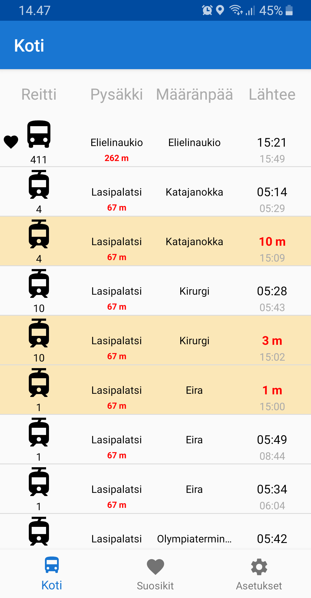
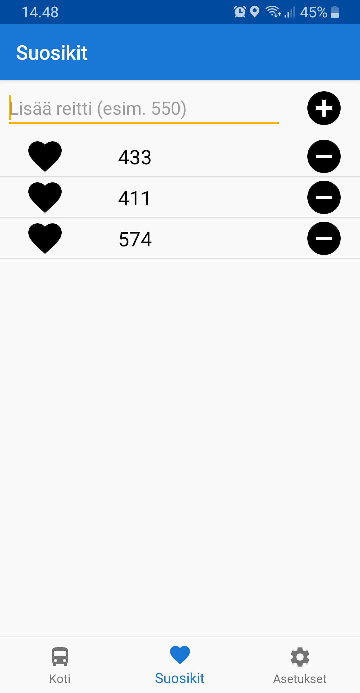
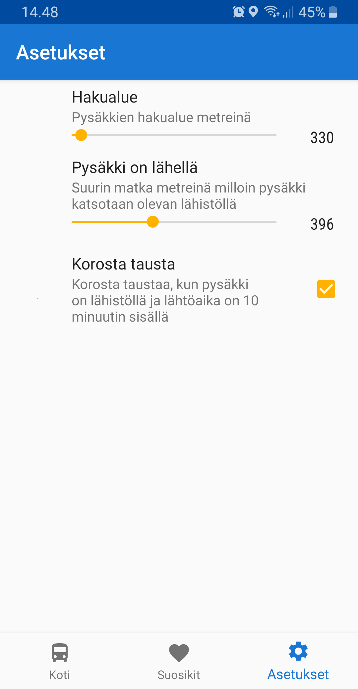

# NextBus or NextDösä 

This project is the end-project for the "Ohjelmistokehityksen teknogioita" course.

My idea for the project is to develop an Android mobile app that shows the user when the next bus (HSL only) comes to bus stop based on the user's location. Android application is going to use Kotlin as the programming language.

Application is going to use HSL's open [API](https://www.hsl.fi/avoindata) to get bus stop's coordinates and timetables.
Users' bus stop preferences are going to stored to local database with Android Room Persistence library or SQLite.

For now, the scale of the project is only to allow users to search for bus routes or bus stops, and to show nearest or selected bus stop's timetable information. I'm not planning to support searching for the fastest route to destination at least yet.

## Projektin palautus
Lopputuloksena on sovellus, jonka avulla voi helposti katsoa milloin seuraava bussi tai juna lähtee käyttäjän lähistöltä.

Sovellus on rakennettu pääasiassa Android Studiolla ja koodattu Kotlinilla.

Sovelluksen käyttöliittymä on jaettu kolmeen välilehteen. Koti, suosikit ja asetukset.

### Kotinäyttö

Kotinäyttö on sovelluksen ensimmäinen välilehti, jossa näkyy lista käyttäjän lähellä olevista pysäkeistä ja niiden läpi kulkevien reittien aikatauluista.

Sovellus käyttää [HSL Reititys APIa](https://digitransit.fi/en/developers/apis/1-routing-api/) listassa näytettävän datan hakemiseen. Haku on aina rajattu käyttäjän sijaintiin ja hakualueeseen, jonka kokoa voi säätää sovelluksen asetuksista. Sovellus tekee haun GraphQL muodossa.

Reittilista käyttää Androidin omaa RecyclerView komponenttia. BusStopAdapter.

Rivien, joiden pysäkki on lähellä ja seuraava lähtöaika on alle kymmenen minuutin sisällä, tausta vaihtaa väriä ja vilkkuu.

### Suosikit

Sovelluksessa on mahdollista tallentaa suosikki reittejä, jotka näytetään ensimmäisenä kotinäytön listassa, jos ne löytyvät tehdyn haun hakualueella.
Suosikkivälilehdessä voi lisätä ja poistaa reittejä suosikeista.

Suosikit tallennetaan sisäiseen tietokantaan Androidin oman Room Persistence kirjaston avulla. Suosikeista ei tallenneta muuta tietoa kuin reitti, joka toimii samalla pääavaimena.
Käyttäjä voi myös lisätä ja poistaa suosikkeja kotinäytöstä, painamalla pohjassa reittiä kotinäytön listassa.

Asetukset välilehdessä käyttäjä voi muuttaa esim. hakualueen laajuutta. 

### Muuta
Sovellus on käännetty sekä englanniksi ja suomeksi. Sovelluksen teksti vaihtuu laitteen kielen perusteella. Oletuksena on kuitenkin englanti, jos laitteen kieli ei ole suomi tai englanti.

### Reflektointi
Opin tekemään API kutsuja GraphQL muodossa, jota en ollut aikaisemmin käyttänyt.
Kehityin paljon Kotlin ohjelmoinnissa. Olin käyttänyt sitä vähän ennen, mutta sillä koodaaminen oli kuitenkin hitaampaa kuin Javalla.
Opin käyttämään Kotlin Coroutineita asynkronisten tehtävien suorittamiseen esim. tietokanta ja rajapinta kutsut.

